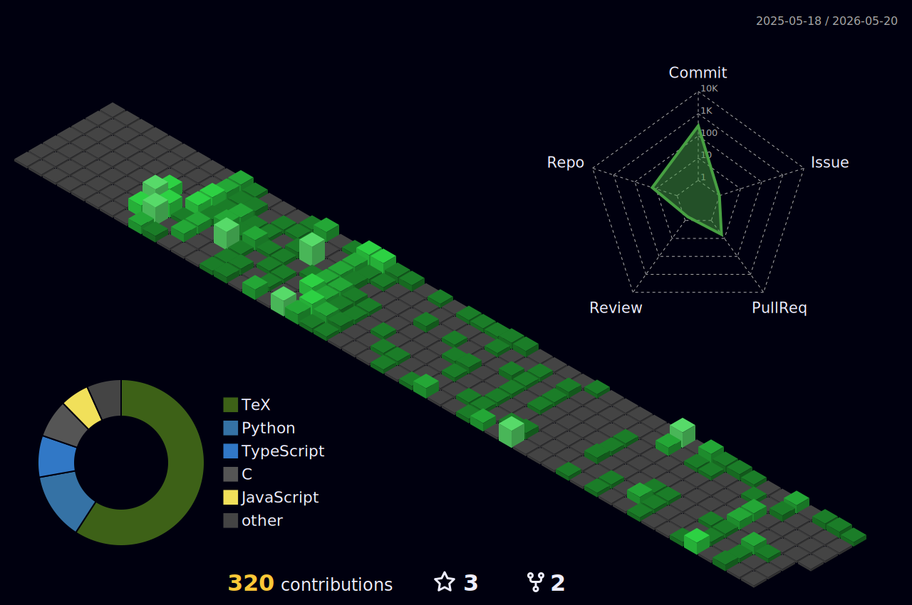

## Hi there 👋, I'm Daniel

- I'm currently studying Computer Science in Bucharest
- Most of my work so far is university-related
- I'm trying to find open source projects I can contribute to when I have the time

## Languages
- One-time experience: Rust
- Small experience: x64 Assembly, Matlab, HTML, CSS, LaTeX
- Moderate experience: C, C++, Python

## 3D Contribution Graph

## Stats

